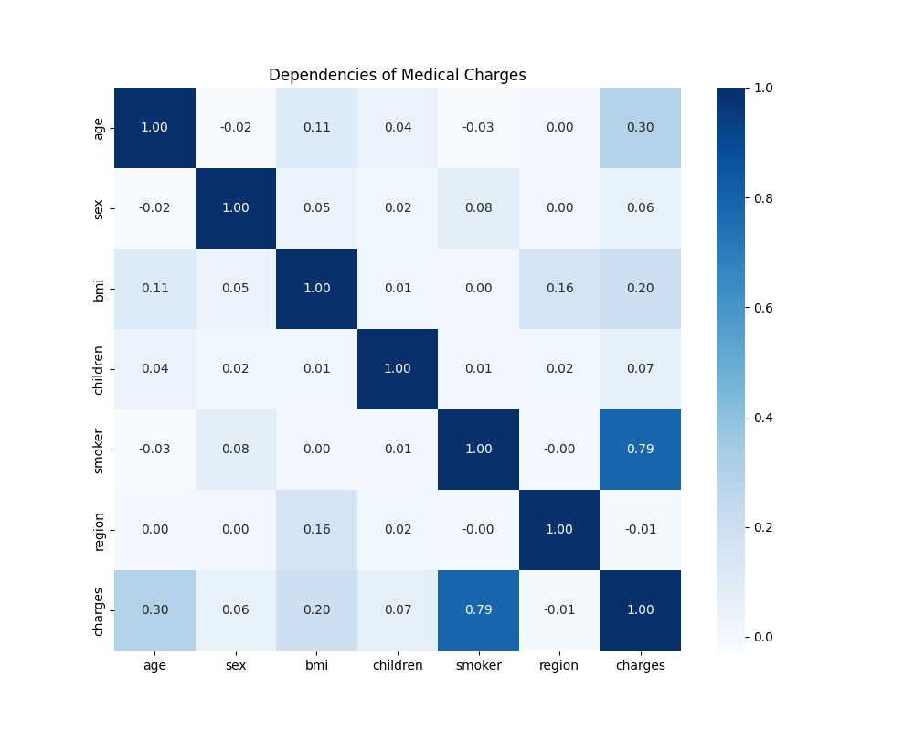
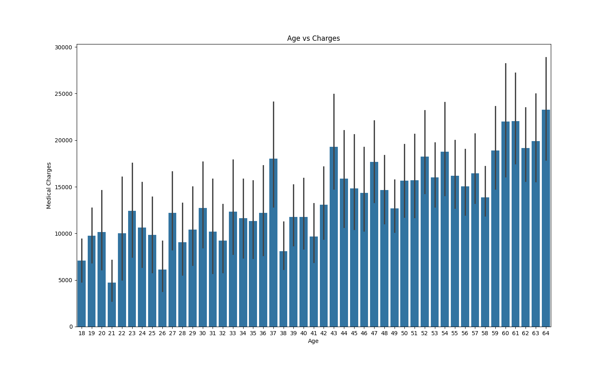
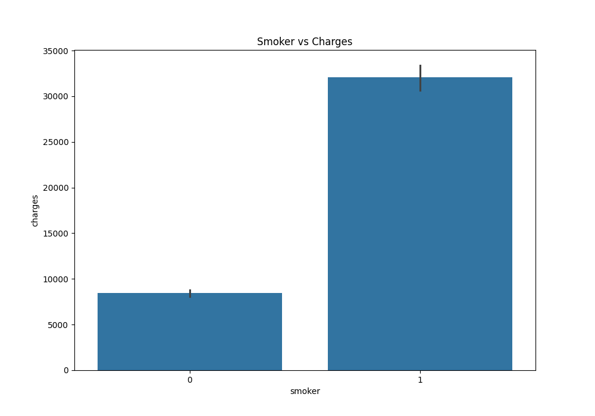
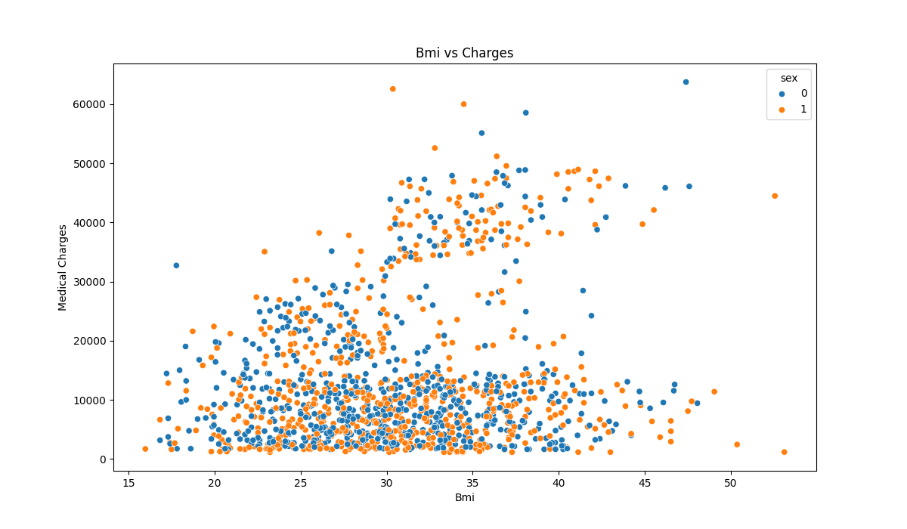
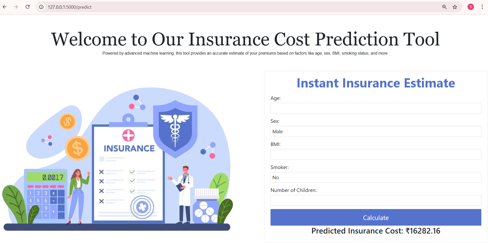

This is a Flask-based web application that predicts medical insurance costs using machine learning.

Features:
- User input for age, BMI, smoking status, etc.
- Prediction using KNN, SVM, and Random Forest models.
- Data visualization using Matplotlib & Seaborn.
- Data preprocessing - LabelEncoder, StandardScaler and handling null values.
- Exploratory Data Analysis

OUTLIER DETECTION : One class svm have been used for detecting the outliers.

Accuracy : 0.86 for Random Forest Model

DEPLOYMENT

